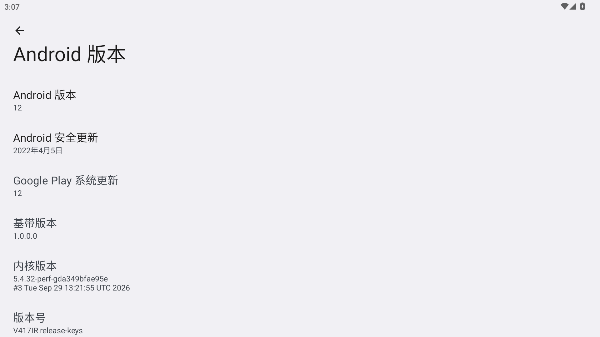
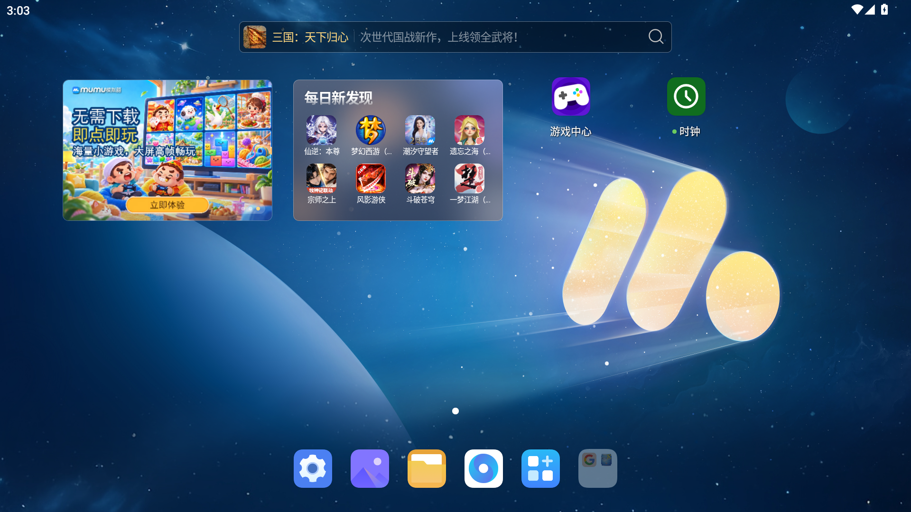
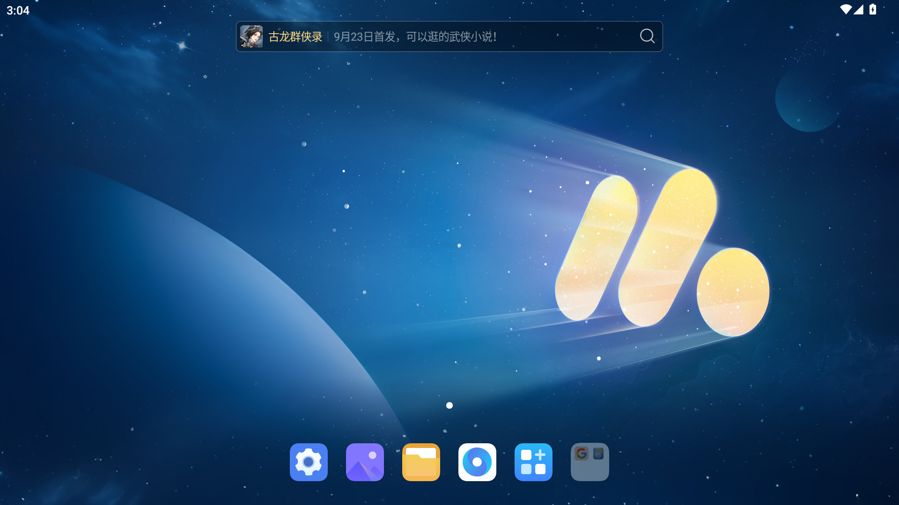
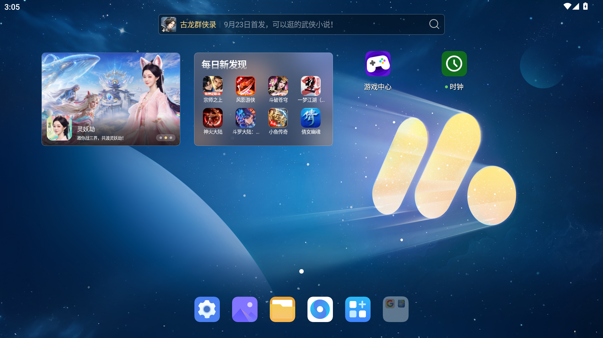
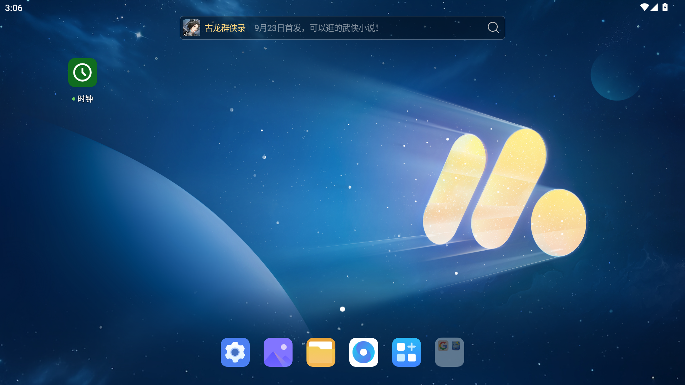
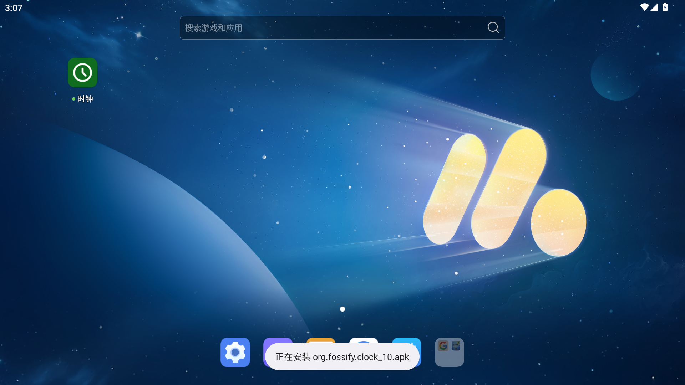
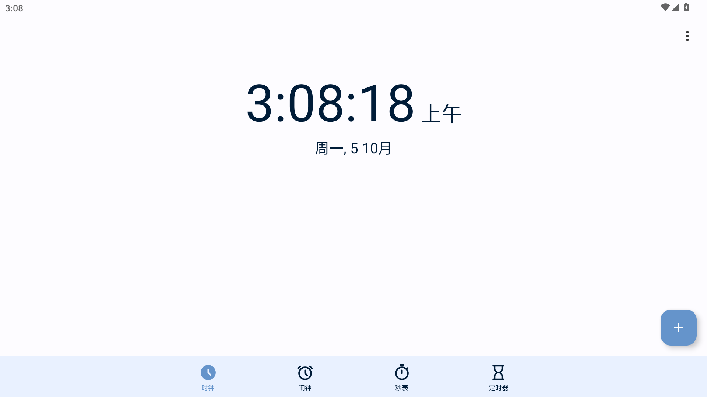

# MuMu Android 12：拖入安装故障与最小安装器验证

需要直接操作的用户，先按 [拖拽安装修复文档](MuMu拖拽安装修复.md) 下载 **部署包 0.1.1** 并安装。0.1（`mumu-minimal-installer-v0.1`）工具包的 Windows 脚本会拒绝 Android 12，不能继续使用旧 ZIP；0.1.1 使用相同的安装器 APK，仅更新部署脚本与验证记录。

## 结果与测试条件

2026-10-05 在 **MuMu 6.8.2.0、Android 12（SDK 32）、原商店 9.2.25（1225）、Root 开关关闭**的实例上进行了真实拖拽测试。同一 APK、同一实例，结果如下：

| 阶段 | 原生拖入结果 | 核对方式 |
|---|---|---|
| 原商店启用 | 成功 | 用户拖入、桌面图标、包安装状态 |
| 临时禁用商店 | 失败 / 无反应 | 用户确认、测试包不存在、安装服务未找到日志 |
| 恢复原商店启用 | 成功 | 用户再次拖入、包安装状态 |
| 更新为最小安装器 | 成功 | 用户拖入、最小安装器成功日志、包安装状态 |
| 回退原商店，再重新部署 | 通过 | 原商店 1225 与系统 APK 路径校验，再部署 1226 |
| 重启后使用最小安装器拖入 | 成功 | 用户拖入、过程截图、Android 和宿主成功日志 |
| 打开已安装的时钟 | 正常启动 | 应用运行截图 |

这证明本次 Android 12 环境同样依赖商店包里的安装服务，最小安装器也可运行。它**没有覆盖所有历史 MuMu 12 客户端或其他商店版本**；issue 反馈者还未提供完整客户端版本，不能声称已完全复刻其环境。

测试 APK 是 F-Droid 的 Fossify Clock 1.6.0，文件 `org.fossify.clock_10.apk`，包名 `org.fossify.clock`。每次验证首次安装前，都会卸载这一测试应用。ADB 用于准备、采集截图和查询日志；表中的拖入安装由用户从 Windows 拖进 MuMu 原生窗口完成。

截图来自该 Android 实例的原始 `screencap`，并在拖入期间按秒采集；不是示意图，也不是 Windows 整屏录制。截图、相关日志摘录与状态摘要都放在 [证据目录](docs/evidence/android12-20261005)。

## 过程与截图

### 1. 确认 Android 12

系统版本页显示 Android 12，版本号为 `V417R release-keys`；ADB 查询 SDK 为 32。实例配置中的 Root 开关为 `false`。



### 2. 原商店启用时，拖入成功

原商店用户状态为 `installed=true hidden=false enabled=0`。拖入后时钟图标出现在原广告组件旁，包管理器确认时钟已安装。



### 3. 禁用商店后，拖入失败

卸载本次测试时钟，再执行 `pm disable-user --user 0 com.mumu.store`，确认 `enabled=3`。用户再次拖入同一 APK 后，没有安装时钟；Android 记录了两次相同错误：

```text
10-05 03:03:34.224 ActivityManager: Unable to start service Intent { cmp=com.mumu.store/.install.InstallLocalApkService (has extras) } U=0: not found
10-05 03:03:37.145 ActivityManager: Unable to start service Intent { cmp=com.mumu.store/.install.InstallLocalApkService (has extras) } U=0: not found
```

下图是失败后的桌面，没有时钟图标。**单凭“桌面没图标”不足以证明故障**，这里同时核对了用户反馈、包不存在和上述服务错误。



### 4. 恢复商店后，拖入恢复

执行 `pm default-state --user 0 com.mumu.store` 恢复到 `enabled=0`。用户再次拖入，确认成功，包管理器也确认已安装。



### 5. 最小安装器保留拖入安装

使用 Windows PowerShell 5.1 部署脚本安装原型，版本号变成 1226，系统 UID 仍为 1000。卸载测试时钟再真实拖入后，最小安装器日志记录 `install-success`。原商店大幅广告和“每日新发现”组件消失，时钟正常安装。



这张图的顶部推广搜索栏仍在，属于定制桌面的独立模块；本工具不保证去掉全部广告。

### 6. 回退、重新部署、重启后再次拖入

`Restore.cmd` 对应脚本成功恢复原商店 1225，并校验使用 `/system/priv-app/com.mumu.store/com.mumu.store.apk`。再安装原型、卸载测试时钟并重启实例后，用户再次真实拖入。

下面两张图来自这一组按秒采集的原始画面：先出现“正在安装”，随后出现“安装完成”。




最后打开时钟，应用正常运行：



---

## 补充原理与验证依据

Windows 原生拖入仍通过 `/apps` 的 `install_with_dynamic_sharedfolder` 请求（`origin=shell`）。Android 12 最小安装器实际收到的是 `/mnt/shared/<mount-id>/org.fossify.clock_10.apk` 形式的 `apk_path`，与 Android 15 实测中收到 `mount_name` / `apk_name` 的形式有区别；两者都经过同一个 `InstallLocalApkService` 入口。

重启后的 Android 日志时间为：

```text
03:07:29.871 service-created uid=1000
03:07:29.872 request com.mumu.store/.install.InstallLocalApkService, apk_path=/mnt/shared/<mount-id>/org.fossify.clock_10.apk
03:07:29.878 install-start package=org.fossify.clock
03:07:30.484 install-success detail=Success
```

宿主同时记录 `install apk: org.fossify.clock, ok, 0`。不能只把 `/apps` 返回 `OK` 当作完成证明；这里还核对了 Android 安装成功记录、包状态、实际图标和应用启动。

两套原商店的 APK 文件散列不同，但其中 `classes.dex` 和 `classes2.dex` 的逐字节内容完全一致，完整签名验证通过，证书 SHA-256 均为：

```text
c8a2e9bccf597c2fb6dc66bee293fc13f2fc47ec77bc6b2b0d52c11f51192ab8
```

机器可读的包状态、用户确认、截图 SHA-256 和 DEX 比较结果见 [verification.json](docs/evidence/android12-20261005/verification.json)，相关 Android 原始日志行见 [installation-log-excerpt.txt](docs/evidence/android12-20261005/installation-log-excerpt.txt)。日志摘录仅替换了共享目录的挂载 ID。

本次使用的安装器 APK 与 0.1 发布版相同，SHA-256：

```text
a03ba9b5286402b4db0df9796a3bcbb82785cd49ac92f5c2ad4638235c63b43a
```

APKS/XAPK/OBB、次用户、关闭 MuMu ADB 开关后的拖入、所有历史客户端及其他商店版本不在这次验证范围内。
